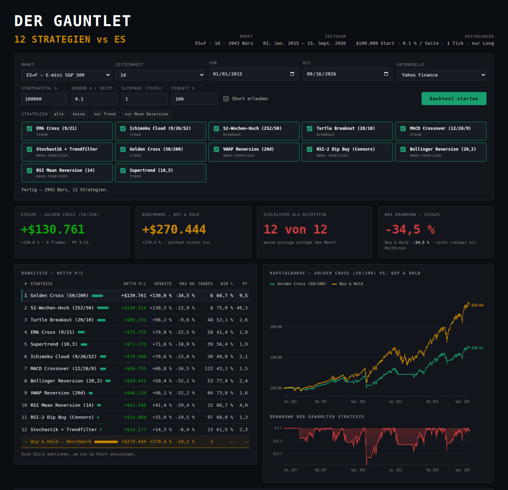

# Der Gauntlet — Strategie-Backtester für ES, NQ & Co.

Ein Backtester für Trading-Strategien auf echten Marktdaten, mit einem
Dashboard im Terminal-Look und einem Pine-Script-Export für TradingView.

* **12 eingebaute Strategien** plus Buy & Hold als Benchmark
* **Echte Marktdaten** — ES und NQ ab dem Jahr 2000, ohne Konto, ohne Ausweis
* **Dashboard** mit Rangliste, Kapitalkurve, Drawdown und Strategie-Auswahl
* **Pine-Script-Export**: jede Strategie auch als TradingView-Skript
* Abhängigkeiten: `pandas`, `numpy`, `requests` — sonst nichts



---

## Dashboard starten

Einmalig, vom Terminal aus:

```bash
git clone https://github.com/maxe24-alt/besserer-trading-bot-.git
cd besserer-trading-bot-
pip install -r requirements.txt
```

Und dann jedes Mal **ein** Befehl:

```bash
./start.sh
```

Das Skript wechselt selbst ins richtige Verzeichnis, findet eine virtuelle
Umgebung (`.venv` im Projekt oder daneben), installiert fehlende Pakete und
startet den Server. Es funktioniert aus jedem Ordner heraus — auch mit dem
vollen Pfad:

```bash
~/trading-bot/besserer-trading-bot-/start.sh
```

Der Browser öffnet sich von selbst auf <http://127.0.0.1:8000>. Anderer Port:
`./start.sh 8080`.

**Das Terminal-Fenster muss offen bleiben** — es ist der Server. Beenden mit
`Strg+C`. Für andere Befehle ein zweites Fenster öffnen.

Ohne Skript geht es natürlich auch:

```bash
cd ~/trading-bot/besserer-trading-bot-     # dorthin, wo das Projekt liegt
source ../.venv/bin/activate               # virtuelle Umgebung aktivieren
python3 -m backtester dashboard
```

Auf macOS heißt der Befehl **`python3`**, nicht `python` — außer die virtuelle
Umgebung ist aktiv, dann geht beides.

Alles läuft auf deinem Rechner; ins Netz geht nur der Kursdownload.

Ohne Browser geht es auch:

```bash
python -m backtester gauntlet --symbol ES   # Rangliste im Terminal
python -m backtester pine --symbol ES       # Pine-Skripte exportieren
```

---

## Woher kommen die Daten? (kostenlos, ohne Ausweis)

Für ES und NQ braucht es **keinen Broker**. Diese Quellen reichen völlig, und
keine davon verlangt eine Ausweiskopie:

| Quelle | Konto nötig? | Was es gibt | Wofür |
|---|---|---|---|
| **TradingView** | E-Mail, kein Ausweis | `CME_MINI:ES1!`, `CME_MINI:NQ1!` im Strategie-Tester | **Empfehlung** — echte CME-Historie, visuell nachvollziehbar |
| **Yahoo Finance** | **gar keins** | `ES=F`, `NQ=F` — Tagesdaten ab 2000, Intraday nur begrenzt | Voreinstellung, läuft sofort |
| **Databento** | E-Mail, kein Ausweis | echte CME-Bars (GLBX.MDP3), 125 $ Startguthaben | Minutendaten über viele Jahre |
| **Stooq** | gar keins | Tagesdaten | Ersatzquelle |
| **CSV** | — | jeder Export | Daten, die du schon hast |
| Alpaca | E-Mail, kein Ausweis | US-Aktien/ETFs (`SPY`, `QQQ`) | **nicht nötig** — bietet keine Futures |

### Wie weit Yahoo zurückreicht

Yahoos Archiv für kurze Zeiteinheiten ist knapp, und die Grenze zählt **ab
heute**, nicht ab dem gewählten Enddatum:

| Zeiteinheit | reicht zurück bis |
|---|---|
| `1d` | Jahr 2000 |
| `1h` | rund 2 Jahre |
| `30m`, `15m`, `5m` | rund 60 Tage |
| `1m` | 7 Tage |

Das Programm kappt den Startzeitpunkt automatisch darauf. Liegt der **ganze**
gewählte Zeitraum außerhalb — etwa 15-Minuten-Daten aus dem Jahr 2020 — sagt es
das im Klartext, statt Yahoo einen Fehlercode zurückgeben zu lassen. Für lange
Intraday-Historie ist Databento die Quelle der Wahl.

### Der empfohlene Weg: Python rechnet, TradingView prüft nach

1. **Python** lädt Yahoo-Daten und rechnet alle 12 Strategien in Sekunden
   durch — kostenlos, ohne Anmeldung, Tagesdaten bis ins Jahr 2000.
2. **TradingView** bekommt dieselbe Strategie als Pine-Skript und rechnet sie
   auf echten CME-Daten noch einmal — mit Chart, Trade-Markierungen und dem
   eingebauten Strategie-Tester.

Stimmen beide Ergebnisse grob überein, ist die Strategie sauber implementiert.
Weichen sie stark ab, steckt in einer von beiden ein Fehler — und genau das
willst du wissen, bevor echtes Geld im Spiel ist.

### Was du zu TradingView wissen solltest

Deine Einschätzung stimmt: TradingView reicht für ES und NQ, kostenlos und
ohne Ausweis. Drei Einschränkungen gibt es trotzdem:

* **Bar-Limit im Gratisplan.** Der Strategie-Tester sieht nur eine begrenzte
  Zahl an Bars. Für Tagesdaten über zehn Jahre genügt das locker; ein
  Minuten-Backtest über mehrere Jahre wird dagegen abgeschnitten. Für lange
  Intraday-Tests ist Python (oder Databento) der bessere Weg.
* **Realtime-CME kostet extra.** Die *historischen* und verzögerten Kurse sind
  gratis — zum Backtesten reicht das vollständig. Nur Live-Kurse in Echtzeit
  sind kostenpflichtig.
* **Ganze Kontrakte.** Futures lassen sich in TradingView nur in vollen
  Kontrakten handeln. „100 % des Kapitals" ergibt bei ES oder NQ weniger als
  einen Kontrakt — ein NQ-Kontrakt entspricht rund 600.000 $, ein ES-Kontrakt
  rund 385.000 $ — und der Strategie-Tester handelt dann **gar nicht**.
  Deshalb setzen die erzeugten Skripte bei Futures eine feste Kontraktzahl
  (Vorgabe: 1, im Skript einstellbar). Der vergleichbare Python-Lauf dazu ist
  `--contracts 1`. Bei Aktien und ETFs bleibt es beim Prozentanteil.

Jedes erzeugte Skript trägt diese Hinweise als Kommentar im Kopf.

### Und MetaTrader?

Hier muss ich widersprechen: **Pine-Skripte laufen in MetaTrader nicht.**
MT4 und MT5 sprechen MQL4 bzw. MQL5 — eine ganz andere Sprache. Dazu kommt:

* ES und NQ gibt es bei MT5-Brokern meist nur als **CFD**, nicht als echten
  CME-Future. Kontraktgröße, Spread und Handelszeiten weichen ab, die
  Backtest-Ergebnisse sind mit CME-Daten nicht vergleichbar.
* Die Kurshistorie kommt vom jeweiligen Broker-Server und ist je nach Anbieter
  unterschiedlich lang und sauber.

Für ES und NQ ist TradingView deshalb klar die bessere Wahl. Wenn du MT5
trotzdem willst, lässt sich ein MQL5-Generator als zweites Ausgabeformat
nachrüsten — die Strategien liegen dafür schon in der passenden Form vor.

---

## Die Strategien

| Key | Strategie | Art | Regel in einem Satz |
|---|---|---|---|
| `ema_cross` | EMA Cross (9/21) | Trend | Long, solange die schnelle EMA über der langsamen liegt |
| `golden_cross` | Golden Cross (50/200) | Trend | Long, solange die 50er SMA über der 200er liegt |
| `macd_cross` | MACD Crossover (12/26/9) | Trend | Long, solange die MACD-Linie über ihrem Signal liegt |
| `ichimoku` | Ichimoku Cloud Breakout | Trend | Long über der Wolke, raus beim Rückfall hinein |
| `supertrend` | Supertrend (10,3) | Trend | Folgt einem ATR-Trailing-Stop und dreht bei jedem Bruch |
| `turtle_breakout` | Turtle Breakout (20/10) | Breakout | Rein über dem 20-Tage-Hoch, raus unter dem 10-Tage-Tief |
| `high_52w` | 52-Wochen-Hoch Momentum | Breakout | Kauft neue Jahreshochs, hält bis zum Bruch |
| `rsi_mean_reversion` | RSI Mean Reversion (14) | Mean Reversion | Kauft überverkauft, verkauft zurück in der Mitte |
| `rsi2_dip` | RSI-2 Dip Buy (Connors) | Mean Reversion | Rücksetzer über der 200er SMA kaufen |
| `bollinger_reversion` | Bollinger Reversion (20,2) | Mean Reversion | Kauft am unteren Band, raus an der Mittellinie |
| `vwap_reversion` | VWAP Reversion (20d) | Mean Reversion | Kauft deutlich unter dem VWAP, raus darüber |
| `stochastic_trend` | Stochastik + Trendfilter | Mean Reversion | Überverkaufte Stochastik, aber nur im Aufwärtstrend |
| `buy_hold` | Buy & Hold | Benchmark | Einmal kaufen, nie wieder anfassen |

Alle Parameter lassen sich überschreiben:

```bash
python -m backtester run ema_cross --symbol NQ --param fast=5 --param slow=30
```

---

## Ein echtes Ergebnis

ES=F, Tagesdaten, 02.01.2015 – 31.08.2026, 100.000 $ Start, 0,1 % Gebühr je
Seite, 1 Tick Slippage, nur Long:

```
#   STRATEGIE                          NETTO P/L   RENDITE   MAX DD  TRADES   WIN %     PF
1   Golden Cross (50/200)              +$134.101    134,1%   -34,5%       6    66,7    9,73
2   52-Wochen-Hoch (252/50)            +$133.648    133,7%   -13,9%       8    75,0   47,41
3   Turtle Breakout (20/10)             +$96.191     96,2%    -9,6%      48    52,1    2,63
4   EMA Cross (9/21)                    +$82.111     82,1%   -22,5%      58    43,1    1,91
…
12  RSI-2 Dip Buy (Connors)             +$14.039     14,0%   -19,5%      95    68,4    1,31
-   BUY & HOLD — BENCHMARK             +$275.802    275,8%   -34,5%       1       –       –
```

**Keine einzige der zwölf schlägt Buy & Hold.** Das ist kein Fehler im
Programm, sondern das ehrliche Ergebnis: Der S&P 500 lief in diesem Zeitraum
fast ununterbrochen nach oben, und jede Strategie, die zwischendurch aussteigt,
verpasst genau davon einen Teil. Wer eine Strategie ohne diesen Vergleich
zeigt, zeigt die halbe Wahrheit.

Interessanter ist die zweite Spalte von rechts: Das 52-Wochen-Hoch holt fast
dieselbe Rendite wie Golden Cross — bei **-13,9 % statt -34,5 % Drawdown**.
Weniger Rendite als Nichtstun, aber deutlich ruhiger.

---

## Wenn eine Zahl zu gut aussieht

Ein Beispiel aus der Praxis: Supertrend auf Ethereum, 2017 bis 2026, 100.000 $
Start — **+7.552 %**. Buy & Hold im selben Zeitraum: +694 %. Das sieht nach einer
Goldgrube aus. Es ist aber fast vollständig der Zinseszins.

Derselbe Lauf, nur mit abgeschaltetem Zinseszins (jede Position wird aus dem
**Startkapital** berechnet statt aus dem aktuellen Kontostand):

| | Netto P/L | Größte Einzelposition | Max DD |
|---|---|---|---|
| mit Zinseszins | +7.551.670 $ | **7.810.585 $** | −51,4 % |
| ohne Zinseszins | +764.338 $ | 96.000 $ | −37,8 % |

Die Regel ist dieselbe, die Trades sind dieselben, die Trefferquote ist dieselbe.
Der Unterschied: im ersten Fall schiebt das System am Ende **7,8 Millionen Dollar**
in einer einzigen Order in Ethereum. Mit einem Tick Slippage gerechnet. Das ist
keine Strategie mehr, das ist eine Exponentialfunktion.

Deshalb zeigt das Dashboard bei der Siegerkachel die **größte Einzelposition** an,
sobald sie das Startkapital deutlich übersteigt — und es gibt das Häkchen
**Zinseszins** zum Abschalten. Auf der Kommandozeile heißt das `--no-compounding`.

Als Faustregel: Wird die größte Position um ein Vielfaches größer als das
Startkapital, ist die Renditezahl eine Rechenübung und keine Aussage darüber, wie
gut die Regel ist. Vergleichbar wird es erst ohne Zinseszins — oder indem man
Netto P/L und Drawdown gegen Buy & Hold hält statt die Prozentzahl allein zu lesen.

---

## Die Kommandozeile

```bash
python -m backtester list                     # Strategien, Quellen, Kontrakte
python -m backtester run <strategie> [...]    # eine Strategie im Detail
python -m backtester gauntlet [strategien]    # Rangliste
python -m backtester pine [strategien]        # Pine-Skripte schreiben
python -m backtester data --symbol ES         # Daten prüfen und exportieren
python -m backtester ideas                    # Notizen aus dem Dashboard
python -m backtester dashboard                # Dashboard starten
```

Wichtige Schalter (gelten für `run`, `gauntlet` und `pine`):

| Schalter | Bedeutung | Standard |
|---|---|---|
| `--symbol`, `-s` | Ticker, auch kurz (`ES`, `NQ`) | `ES=F` |
| `--start`, `--end` | Zeitraum | 2015-01-01 bis heute |
| `--interval`, `-i` | `1d`, `1h`, `15m`, `5m`, `1m` | `1d` |
| `--provider`, `-p` | `yahoo`, `csv`, `stooq`, `databento`, `alpaca` | `yahoo` |
| `--capital` | Startkapital | `100000` |
| `--fee` | Gebühr je Seite in Prozent | `0.1` |
| `--slippage` | Slippage in Ticks | `1` |
| `--exposure` | Kapitalanteil je Position | `1.0` |
| `--contracts` | feste Kontraktzahl statt Prozentgröße | — |
| `--allow-short` | Short-Positionen zulassen | aus |
| `--no-compounding` | Position immer aus dem Startkapital berechnen | aus |

Beispiele:

```bash
# NQ über 10 Jahre, alle Strategien, Rangliste als CSV
python -m backtester gauntlet --symbol NQ --start 2016-01-01 --csv nq.csv

# Ein fester Kontrakt MES statt prozentualer Größe
python -m backtester run turtle_breakout --symbol MES --contracts 1

# Stundendaten (Yahoo liefert dafür rund zwei Jahre)
python -m backtester gauntlet --symbol ES --interval 1h --start 2024-06-01
```

---

## Das Notizbuch

Unten im Dashboard steht ein Textfeld. Was dir beim Anschauen eines Ergebnisses
auffällt, schreibst du dort hinein — die nächste Strategie, eine Idee zur
Verbesserung, ein Verdacht.

**Der aktuelle Lauf hängt automatisch mit dran**: Markt, Zeiteinheit, Zeitraum,
die gerade ausgewählte Strategie samt Parametern und ihren Kennzahlen. Genau
das macht den Unterschied zwischen einer brauchbaren Notiz und einem Zettel,
der drei Tage später nichts mehr sagt.

Zwei Knöpfe:

* **Notieren** — speichert in `ideen/ideen.md` und `ideen/ideen.json`
  (`Strg`/`Cmd` + `Enter` tut dasselbe)
* **Für Claude kopieren** — legt Notiz plus Lauf-Kontext als fertigen Text in
  die Zwischenablage, den du direkt in den Chat einfügst

Eine kopierte Notiz sieht so aus:

```
RSI-2 braucht einen ATR-Stop — 95 Trades für 14 % sind zu teuer.

Bezieht sich auf:
Markt: ES=F · 1d · 2015-01-01 bis 2026-09-01
Strategie: RSI-2 Dip Buy (Connors) (rsi_length=2, entry_level=10, …)
Ergebnis: +$14.039 · +14,0 % · Max DD -19,5 % · 95 Trades
Bedingungen: 100.000 $ Start · 0.1 % je Seite · 1 Tick · nur Long
```

Erledigte Notizen hakst du ab. Im Terminal:

```bash
python -m backtester ideas              # alle Notizen
python -m backtester ideas --open-only  # nur die offenen
python -m backtester ideas --prompt     # alles als Text zum Weitergeben
```

Wer die Ideen aus dem Dashboard heraus direkt von einem Modell beantworten
lassen will, braucht einen API-Schlüssel und damit ein Konto mit Abrechnung.
Bewusst nicht eingebaut: das Dashboard soll offline und kostenlos laufen. Der
Weg über die Zwischenablage kostet einen Klick mehr und nichts an Geld.

---

## Der Pine-Script-Export

```bash
python -m backtester pine --symbol ES --out pine
```

Schreibt für jede Strategie eine `.pine`-Datei. In TradingView:

1. Chart auf `CME_MINI:ES1!` stellen, Zeiteinheit passend wählen (`1d` → D)
2. Unten den **Pine-Editor** öffnen → *Neu* → *Leeres Strategie-Skript*
3. Inhalt der `.pine`-Datei einfügen → **Zum Chart hinzufügen**
4. Reiter **Strategie-Tester** zeigt Ergebnis, Kapitalkurve und alle Trades

Im Dashboard geht es noch schneller: Strategie in der Rangliste anklicken, der
passende Code steht unten und lässt sich mit einem Klick kopieren.

### Warum die Zahlen vergleichbar sind

Das erzeugte Skript bildet das Ausführungsmodell der Python-Engine gezielt nach:

| Python-Engine | Pine-Script |
|---|---|
| Signal am Bar-Schluss, Ausführung zur nächsten Eröffnung | `process_orders_on_close = false` |
| `sizing="equity_pct"`, `exposure=1.0` | `default_qty_type = strategy.percent_of_equity`, `100` |
| `fee_pct = 0.1` | `commission_type = percent`, `commission_value = 0.1` |
| `slippage_ticks = 1` | `slippage = 1` |
| `long_only = True` | nur `strategy.entry(..., strategy.long)` |
| Ausstieg wird vor dem Einstieg geprüft | `if longExit …` steht vor `if longEntry …` |

Das Zeitfenster im Skript ist **standardmäßig aus** — der Test läuft über
alles, was der Chart hergibt. Sonst würde ein Enddatum in der Vergangenheit die
jüngsten Bars stillschweigend ausklammern, und auf einer 5-Minuten-Einstellung
bliebe womöglich gar kein Bar übrig. Einschalten lässt es sich in den
Skript-Einstellungen unter „Zeitfenster begrenzen".

Restliche Abweichungen (Bar-Limit im Gratisplan, Anlaufphase von Supertrend
und Ichimoku) stehen als Kommentar im Kopf jedes Skripts.

---

## Wie die Engine rechnet

Der wichtigste Punkt zuerst: **keine Strategie kann in die Zukunft schauen.**

1. Die Strategie entscheidet am **Schluss** einer Bar über ihre Zielposition.
2. Die Engine führt diese Entscheidung zur **Eröffnung der nächsten Bar** aus.
3. Danach wird die Position zum Schlusskurs bewertet.

Dieser Versatz um eine Bar ist fest eingebaut und durch Tests abgesichert
(`tests/test_engine.py::NoLookaheadTest`). Er ist der Grund, warum die
Ergebnisse hier niedriger ausfallen als in vielen Backtests, die im Netz
kursieren.

**Kosten** fallen auf jeder Seite an: Gebühr in Prozent des Volumens,
optional eine Kommission je Kontrakt, dazu Slippage in Ticks — immer gegen
die eigene Position.

**Positionsgröße** — zwei Modi:

* `equity_pct` (Standard): Volumen = Kapital × Einsatzanteil. Bei 100 % ist
  das genau mit Buy & Hold vergleichbar, weil beide gleich viel Kapital
  einsetzen.
* `contracts`: feste Kontraktzahl. Hier schlägt der Punktwert voll durch —
  ES 50 $, NQ 20 $, MES 5 $, MNQ 2 $ je Indexpunkt.

**Kennzahlen**: Netto-P/L, Rendite, CAGR, Max Drawdown, längste Verlustphase,
Volatilität, Sharpe, Sortino, Calmar, Trades, Trefferquote, Profit-Faktor,
Erwartungswert, Durchschnittsgewinn und -verlust, Haltedauer, Zeit im Markt.

---

## Eine eigene Strategie hinzufügen

Eine Unterklasse mit `@register` genügt — CLI, Dashboard und Gauntlet finden
sie danach von allein:

```python
# backtester/strategies/meine.py
from .. import indicators as ta
from .base import Param, PineSpec, Strategy, hold_position, register


@register
class MeineStrategie(Strategy):
    key = "meine_strategie"
    display_name = "Meine Strategie"
    category = "trend"
    description = "Kauft den Ausbruch über die obere ATR-Bande."
    params = (
        Param("length", 20, "Fenster", "int", 5, 200),
        Param("factor", 2.0, "ATR-Faktor", "float", 0.5, 10.0, 0.1),
    )

    def compute(self, df):
        band = ta.sma(df["close"], self.settings["length"]) \
             + self.settings["factor"] * ta.atr(df, 14)
        return hold_position(df["close"] > band, df["close"] < ta.sma(df["close"], self.settings["length"]))

    def pine(self):                      # optional - für den TradingView-Export
        return PineSpec(
            mode="event",
            inputs=(
                'len = input.int({length}, "Fenster", minval=5)',
                'factor = input.float({factor}, "ATR-Faktor", minval=0.5, step=0.1)',
            ),
            calc=("mid = ta.sma(close, len)", "band = mid + factor * ta.atr(14)"),
            long_entry="close > band",
            long_exit="close < mid",
        )
```

Dann in `backtester/strategies/__init__.py` importieren (`from . import meine`)
und den Key in `DEFAULT_ORDER` eintragen, falls er im Gauntlet mitlaufen soll.

---

## Tests

```bash
python -m unittest discover -s tests -t .
```

167 Tests, komplett offline — synthetische Kursreihen statt Downloads.
Geprüft werden unter anderem: dass Buy & Hold exakt der Kursbewegung
entspricht, dass Einstiege zur Eröffnung der Folgebar erfolgen, dass ein
Signal auf der letzten Bar keinen Trade mehr auslöst, dass Kennzahlen
handgerechneten Werten entsprechen und dass jedes Pine-Skript strukturell
gültig ist. Das Notizbuch wird ebenfalls geprüft, unter anderem darauf, dass
der Browser nur bekannte Felder in die Notizdatei schreiben kann.

---

## Projektaufbau

```
backtester/
  instruments.py        Kontraktspezifikationen (Punktwert, Tick, Kommission)
  indicators.py         Indikatoren auf pandas-Basis, ohne TA-Lib
  pine.py               Pine-Script-Generator
  ideas.py              Notizbuch (ideen/ideen.md und .json)
  cli.py, server.py     Kommandozeile und Dashboard-Server
  data/                 Yahoo, CSV, Stooq, Databento, Alpaca + Cache
  strategies/           Registry, Basisklasse und die 12 Strategien
  engine/               Backtest-Engine, Kennzahlen, Gauntlet
  report/               Terminal-Ausgabe
web/                    Dashboard (HTML, CSS, SVG-Charts ohne Bibliothek)
pine/                   fertig erzeugte Pine-Skripte für ES
ideen/                  deine Notizen (entsteht beim ersten Speichern)
tests/                  167 Tests
```

---

## Wichtiger Hinweis

Backtests zeigen, wie eine Regel in der **Vergangenheit** gelaufen wäre. Sie
sagen nichts über die Zukunft. Wer lange genug an Parametern dreht, findet
immer eine Kombination, die historisch hervorragend aussieht und live nichts
taugt — das nennt sich Overfitting.

Dieses Programm ist ein Analysewerkzeug, keine Anlageberatung.
